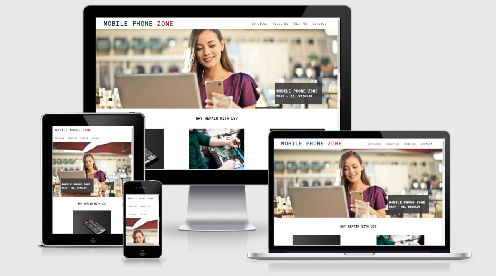

# Mobile Phone Zone

Mobile Phone Zone is a phone shop that provides repair services for mobile phones, tablets and laptops. It also offers the sale of mobile phones, tablets and accessories.

The site uses a one-page format, this makes it especially easy to navigate on mobile and desktop.

# Features

### Existing Features

- __Navigation Bar__

    - The navigation bar is located above the image with the logo company.

    - Has a hover function that changes the size of the text menu.

- __The landing page image__

    - The landing page includes a person holding a mobile device and a laptop, while below, there is another image superimposed with the company name and address. 

    - This section introduces the user to the phone shop.

- __Repair Section__

    - In the repair section, the user will be able to see all the services that the store has.

    - The user with this information may decide to contact us.

  

  - __About Us__

     - Tell a little story of how the company started.

  

  - __Sign up Section__

    - This page will allow the user to subscribe to the store to receive future promotions. The user will be asked to submit their full name and email address.

    

    - In the future, a text box will be, added so that people can send messages directly to the site, and we will be able to use their emails to capture leads.

- __Contact Section__

    - The contact has two sections, one with the information about the opening times, contact e-mail and address.

    

    - In this section there is a map with the precise location of the store

    

    - __Footer__

        - Links to social media
        - Hover feature with a bigger size that matches navigation bar
        - Directs user to the respective site on a new page

    

    # Testing

    - This project is responsive looks good, and functions on all standard screens sizes using the devtools device toolbar.        
    - I tested that this page works in different browsers: Chrome, Firefox, Safari.
    - The navigation, header, services, about us, sign up and contact text are all readable and easy to understand.
    - I have confirmed that the form works with require entries in every field and submit buttom works.

    # Unfixed Bugs

    ### Navigation bar

    - The navigation bar for mobile devices is not perfect. In the future, after acquiring better abilities, I will make these changes.

    # Fixed Bugs

    - With the use of float, the site was broken and, after using flexbox, the website got better.

    ## Validator Testing

    - HTML
        - No errors were returned when passing through the official W3C validator

    

    - CSS
        - No errors were returned when passing through the official (Jigsaw) validator

    

    - Acessibility
        - I confirmed that the colours are easy to read and accessible by running it through lighthouse in devtools

    

    # Deployment

    - The site was deployed to GitHub pages. The steps to deploy are as follows:

    - In the GitHub repository, navigate to the Settings tab In the pages section, go to select branch drop-down menu, select Main Once the Main branch has been selected, a link to the site is provided

    - The live link can be found here - https://pagioro.github.io/first-project/

    # Credits

    ### content

    - When making my project, I was inspired by the Code Institute love running project.

    - Font was sourced from Google Fonts https://fonts.google.com/

    - Icons were sourced from Font Awesome https://fontawesome.com/

    - I used cloudconvert and ezgif to minimize the image file sizes https://cloudconvert.com/jpg-to-webp and https://ezgif.com/optiwebp

    ### media

    - All pictures were taken from the open source site Pexels https://www.pexels.com/

       

       

       

       
            
       

       

    
    

    