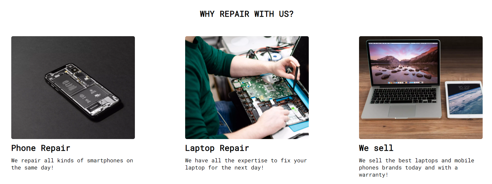
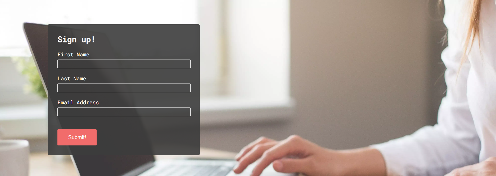

# Mobile Phone Zone

Mobile Phone Zone is a store that provides repair and sale services for cell phones, tablets and laptops to people from the city of Bray who are looking for serious and quality professional service at an affordable price.

The store also sells new and remanufactured cell phones, laptops and tablets with a high-quality standard.

The site uses a one-page format, this makes it especially easy to navigate on mobile and desktop.

# Design Choices

   - A minimalist design was chosen, for easy navigation.

   - The colours and photos were chosen in pastel tones to pleasure the user's eyes.

   - The chosen font is easy to read.

   - Passed WCAG Contrast Checker with the highest score triple-A.

   

# Features

### Existing Features

- __Navigation Bar__

    - The navigation bar is located above the image with the logo company.

    - Has a hover function that changes the size of the text menu.

- __The landing page image__

    - The landing page includes a person holding a mobile device and a laptop, while below, there is another image superimposed with the company name and address. 

    - This section introduces the user to the phone shop.

- __Repair Section__

    - In the repair section, the user will be able to see all the services that the store has.

    - The user with this information may decide to contact us.

  

  - __About Us__

     - Tell a little story of how the company started.

  

  - __Sign up Section__

    - This page will allow the user to subscribe to the store to receive future promotions. The user will be asked to submit their full name and email address.

    

    - In the future, a text box will be, added so that people can send messages directly to the site, and we will be able to use their emails to capture leads.

- __Contact Section__

    - The contact has two sections, one with the information about the opening times, contact e-mail and address.

    

    - In this section there is a map with the precise location of the store

    

    - __Footer__

        - Links to social media
        - Hover feature with a bigger size that matches navigation bar
        - Directs user to the respective site on a new page

    

    # Testing

    - This project is responsive looks good, and functions on all standard screens sizes using the devtools device toolbar.        
    - I tested that this page works in different browsers: Chrome, Firefox, Safari.
    - The navigation, header, services, about us, sign up and contact text are all readable and easy to understand.
    - I have confirmed that the form works with require entries in every field and submit buttom works.

    # Unfixed Bugs

    ### Navigation bar

    - The navigation bar for mobile devices is not perfect. In the future, after acquiring better abilities, I will make these changes.

    # Fixed Bugs

    - With the use of float, the site was broken and, after using flexbox, the website got better.

    ## Validator Testing

    - HTML
        - No errors were returned when passing through the official W3C validator

    

    - CSS
        - No errors were returned when passing through the official (Jigsaw) validator

    

    - Acessibility
        - I confirmed that the colours are easy to read and accessible by running it through lighthouse in devtools

    

    # Deployment

    - The site was deployed to GitHub pages. The steps to deploy are as follows:

    - In the GitHub repository, navigate to the Settings tab In the pages section, go to select branch drop-down menu, select Main Once the Main branch has been selected, a link to the site is provided

    - The live link can be found here - https://pagioro.github.io/first-project/

    # Credits

    ### content

    - When making my project, I was inspired by the Code Institute love running project.

    - Font was sourced from Google Fonts https://fonts.google.com/

    - Icons were sourced from Font Awesome https://fontawesome.com/

    - I used cloudconvert and ezgif to minimize the image file sizes https://cloudconvert.com/jpg-to-webp and https://ezgif.com/optiwebp

    ### media

    - All pictures were taken from the open source site Pexels https://www.pexels.com/

       

       

       

       
            
       

       

    
    

    